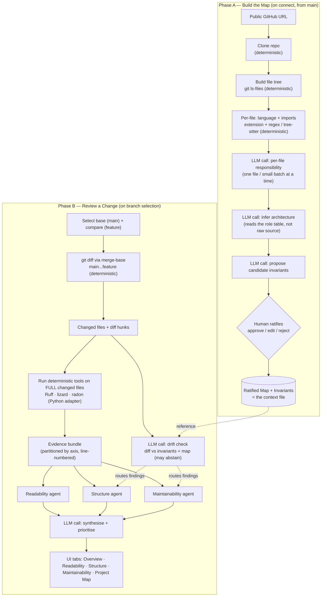

# Smart Code Reviewer — Technical Design Document

## 1. Purpose

An AI pre-review assistant that runs *before* a human opens a pull request. It reviews code on three axes — **readability, structure, and maintainability** — and additionally catches **architectural drift**: code that is locally clean but doesn't fit the established shape of the codebase.

The differentiator is not "we called an LLM." It is *how* the LLM is used. Every judgement the model makes is grounded in something external: either a deterministic static-analysis tool (with a line number) or a ratified architectural rule (with a rule name). The model's job is to interpret, prioritise, and communicate that evidence like a senior reviewer — not to hunt for issues from a blank slate.

> **Language.** The architecture is language-neutral. Everything the model touches — the project map (§7), the three review agents (§6), the drift check (§8), and the synthesis step — consumes *findings*, not source, so none of it depends on the target language. The single language-dependent component is the deterministic tool layer (§5), which is a **pluggable adapter**: cross-language analysers (lizard) cover what they can, and language-specific tools fill the rest.
>
> This reference implementation targets **Python**, chosen deliberately so the tool can be pointed at its own codebase — the reviewer reviews itself (§10). Its adapter uses `lizard` (cross-language) for structural metrics, `Ruff` for readability, idioms, and warnings, and `radon` for the maintainability index. The originally-scoped language, C++, is supported by the same architecture with a different adapter (clang-tidy, cppcheck, clang-format, lizard); the signal set, the axis partition, and the thresholds are identical — only the producing tool changes.

---

## 2. Core design principle

Three rules hold the whole system together and are the reason it stays reliable under scrutiny:

1. **Deterministic where possible, LLM only for judgement.** File trees, language detection, import extraction, and git diffs are computed by code, not guessed by a model. The model is handed ground truth and asked only for the qualitative call on top.
2. **One decision type per LLM call.** Reliability is a property of decomposition, not of the model. A call that makes one bounded judgement against provided evidence is trustworthy; a call that makes many entangled judgements at once wanders. Every LLM step below does exactly one thing.
3. **No claim without a citation.** Every finding points to either a line number (from a tool) or a named invariant (from the map). Anything the model cannot attach to evidence, it does not raise. This is the hallucination firewall, and because citations are visible in the output, the rigour is something the reviewer can *see*.

---

## 3. System overview

The system has two phases. **Phase A** builds a map of the codebase once, when a project is connected. **Phase B** reviews an incoming change against that map plus the deterministic tools.

The tool nodes are the only language-specific box in either phase. Everything else — clone, tree, per-file roles, architecture inference, diff, the three agents, drift, synthesis — is identical regardless of the target language.

---

## 4. Inputs

### 4.1 Connecting a project

The tool runs locally. A project is connected by giving it the URL of a **public GitHub repository**. The tool clones the repo and works entirely from the local source — no GitHub write access, no app installation, no credentials. This keeps the demo self-contained and avoids any confidential-data concern.

### 4.2 Reviewing a change (branch selection)

Changes are supplied by **branch selection**, not file upload. The user picks two branches:

- a **base branch** (typically `main`) — this represents the *established architecture*. Its map and ratified invariants are the reference point.
- a **compare branch** (the feature branch) — the *proposed change* to be evaluated.

Git then computes the delta, and the pipeline runs on it. Two details make this correct rather than merely plausible:

**Use a three-dot diff.** `git diff main...feature` shows what the feature branch has introduced *since it forked* from main (i.e. changes since the merge-base), which is exactly what a real PR review shows. A two-dot diff (`main..feature`) compares the raw branch tips and would fold in unrelated commits that landed on main after the branch forked — noise you don't want.

**The diff scopes the work; the tools need whole files.** The diff identifies *which* files and functions changed. But metrics like cyclomatic complexity and function length cannot be computed from isolated diff hunks — a three-line change may sit inside a 200-line function. So the deterministic tools run on the **full changed files** (checked out from the feature branch), and findings are then attributed back to the changed regions. Demo granularity of "full changed files" is sufficient; scoping down to individual changed functions is a refinement.

---

## 5. Deterministic tools (the evidence layer)

These tools run once per review and produce objective, line-numbered findings. The findings are then **partitioned by axis** into an evidence bundle before any agent sees them. This partitioning — not the tabbed UI — is what actually prevents the three agents from producing overlapping output. Each signal has exactly one home.

This is the **one language-dependent layer** in the system (§1). It is a pluggable adapter: where a cross-language analyser exists it is used directly; language-specific tools fill the gaps. The tables below give the **Python** reference adapter (`Ruff`, `lizard`, `radon` — all `pip install`-able); the C++ adapter is described at the end of the section. Two consequences of this split are worth flagging up front:

- **The entire Structure axis is cross-language.** `lizard` computes cyclomatic complexity, NLOC, and parameter count for Python, C++, Java, JavaScript, and more from one invocation — so Structure needs *no* per-language work at all.
- **The composite maintainability index — thin in C++ — is first-class in Python.** `radon mi` computes it directly from the same SLOC + cyclomatic + Halstead-volume formula Visual Studio uses; the C++ plan could only approximate it.

### Readability

| Signal | Tool | What it flags | Rough threshold |
|---|---|---|---|
| Identifier naming | Ruff `N` (pep8-naming) | Names that break the chosen convention | Any violation (configurable) |
| Magic numbers | Ruff `PLR2004` | Unnamed literals (in comparisons) that should be named constants | Any magic value in a comparison — narrower than the C++ check, which flags all non-trivial literals |
| Redundant control flow | Ruff `RET` (flake8-return) + `SIM` (flake8-simplify) | `else` after `return`, convoluted booleans, collapsible blocks | Any occurrence |
| Formatting drift | `ruff format --diff` (or Black `--check --diff`) | Indentation, spacing, line length, quote style | % of lines reformatted — higher is worse |

*The C++ "missing braces" signal has no Python analogue — indentation is syntactic, so a single-statement block cannot go unbraced. It is simply absent from the Python adapter; a language-specific signal dropping out cleanly is exactly what the adapter split is for.*

### Structure

| Signal | Tool | What it flags | Rough threshold |
|---|---|---|---|
| Cyclomatic complexity (CCN) | lizard *(cross-language)* | Independent paths through a function | >10 smell, >15 concerning, >20 refactor (lizard warns at 15 by default) |
| Function length (NLOC) | lizard *(cross-language)* | Lines per function → doing too much | >50 look, >100 bad |
| Parameter count | lizard *(cross-language)* | Long argument lists → weak cohesion | >4 smell |
| Cognitive complexity / nesting | complexipy *(optional)* | Deeply nested, hard-to-track logic | >15 concerning (configurable) |
| Decomposition | lizard (summary) *(cross-language)* | God-functions vs sensible breakdown | Qualitative |

*Unlike C++ (where clang-tidy ships a standard cognitive-complexity check), Python has no single de-facto tool for it. `lizard`'s cyclomatic complexity is the always-on structural metric; a dedicated cognitive-complexity checker such as `complexipy` is an optional addition, and the Structure agent can reason about nesting from the cyclomatic and length signals regardless.*

### Maintainability

| Signal | Tool | What it flags | Rough threshold |
|---|---|---|---|
| Static-analysis warnings | Ruff `F` (pyflakes) + `B` (flake8-bugbear) | Unused vars/imports, dead code, likely-bug patterns | Density (warnings per LOC) |
| Outdated idioms | Ruff `UP` (pyupgrade) | Legacy syntax the target Python version makes obsolete | Any occurrence |
| Code duplication | lizard `-Eduplicate` *(cross-language)* | Copy-pasted blocks → change amplification | Duplicated blocks present |
| Composite index | `radon mi` | Single 0–100 "how painful to maintain" score | 0–100, higher better; computed directly, no approximation |

*The C++ adapter uses cppcheck here, whose strengths are memory- and resource-safety (null derefs, leaks) — largely inapplicable to Python. The Python adapter's nearest equivalent is Ruff's pyflakes + bugbear rules (unused code, likely bugs). For the closest analogue to the correctness bugs cppcheck catches, a type checker (mypy, pyright, or Astral's `ty`) can be added to this axis — type errors are Python's nearest counterpart. It is optional and not part of the reference build.*

**Routing note:** function length lives only under Structure (lizard's NLOC), even though Ruff's `PLR0915` (too-many-statements) could surface a related smell under a warnings lens. Leaving both on would report the same problem in two tabs and manufacture the overlap the design is trying to avoid. One signal, one home.

### The C++ adapter

The same evidence layer targets C++ by swapping the producing tools; the signal set, the axis partition, and the thresholds are unchanged. clang-tidy covers naming (`readability-identifier-naming`), magic numbers (`readability-magic-numbers`), missing braces (`readability-braces-around-statements`), redundant control flow (`readability-else-after-return`, `-simplify-boolean-expr`), cognitive complexity (`readability-function-cognitive-complexity`), and outdated idioms (`modernize-*`); cppcheck covers static-analysis warnings; clang-format covers formatting drift; and `lizard` — being cross-language — is shared unchanged for the whole Structure axis and for duplication. Only the composite maintainability index is weaker on this side: C++ has no first-class Maintainability Index tool, so it is approximated from lizard's CCN/NLOC plus a Halstead estimate. Standing each tool up is a one-line `apt-get` in a container.

---

## 6. The three review agents

The agents are **presentation specialists**, each interpreting its own slice of the evidence bundle. Because the evidence is partitioned upfront (§5), the agents cannot repeat each other across tabs. They consume findings, not source, so they are language-neutral — the same three agents serve any adapter.

- **Readability agent** — takes the naming, magic-number, control-flow, and formatting findings and explains them in human terms, plus makes the qualitative calls tools can't: is this name actually *good*, not just conformant.
- **Structure agent** — takes the complexity, length, parameter, and nesting numbers and explains what they imply about decomposition, plus receives architectural-drift findings that concern structure.
- **Maintainability agent** — takes the warning density, duplication, idiom, and composite-index signals, plus drift findings that concern maintainability.

Above the three sits a **synthesis step**: a single LLM call that reads all findings and produces a prioritised overview — the top handful of things to fix first and an overall verdict. This is what carries the tool from "linter with a nice UI" to "reasons like a reviewer," and it is the strongest line for the project summary. It surfaces in an **Overview tab** the reviewer sees immediately.

---

## 7. The project map (the context file)

The map is a maintained description of the codebase — conceptually the same family as **CLAUDE.md** (Claude Code's `/init`), **Cursor Rules**, and Copilot's `.github/copilot-instructions.md`. It is what lets the tool catch the one class of problem linters structurally cannot: code that passes every check and still doesn't belong.

### 7.1 What it contains

Two layers, deliberately:

- **Prose** — a human-readable description: the directory tree, what each file/module is responsible for, the key modules, and how they relate. This is for people.
- **Invariants** — a small set of explicit, checkable rules. This is for the machine. Examples: dependency/layering rules ("`ui/` may depend on `core/`, never the reverse"; "only `net/` opens sockets"), per-module responsibility ("`parser/` does tokens→AST, no I/O"), and directory-level naming/ownership conventions.

The invariants are the critical part. If "the architecture" lived only as prose, asking the model "does this new code violate it?" would return vibes — it would flag legitimate refactors and wave through real violations, because prose isn't a spec. The invariant list gives the drift check something concrete to cite, which is what makes its verdicts trustworthy.

### 7.2 How it's built — the climb

The map is not one LLM output. It is the accumulated product of a layered climb where each rung consumes the *verified* output of the rung below, so errors can't silently compound and, when something is off, you can see which rung produced it. Deterministic steps do as much as possible; the model is only invoked for genuine judgement.

1. **File tree** — from `git ls-files` or a directory walk. Deterministic, correct by construction, zero tokens.
2. **Per-file language + imports** — extension maps to language; import extraction via regex or tree-sitter (`import` / `from … import` in Python, `#include` in C++). Deterministic. Fed as ground truth into step 3.
3. **Per-file responsibility** — LLM, **one file (or a small batch of related files) at a time**. Your code reads the file and places its contents in front of the model; the model returns only the responsibility judgement. Code fetches, model judges — the model is never responsible for retrieval. Small, bounded, and parallelisable across files.
4. **Architecture inference** — LLM, the one genuine synthesis call. It reads the *table of per-file roles* from step 3 (not the raw source again) and infers the layers, modules, and their relationships. Reasoning over the structured digest keeps it in-window and grounded in verified facts.
5. **Candidate invariants** — LLM proposes rules drawn from step 4, e.g. "`parser/` appears to do tokens→AST with no I/O — make that an invariant?"

### 7.3 Human ratification

Deriving invariants is the honest weak link: a plausible-but-wrong invariant is *worse* than none, because it fails good code and erodes trust. So step 5 is not automated blind. The model **proposes**; a human **approves, edits, or rejects** each candidate once, at setup. This converts the shakiest step into a solid one — and "AI drafts the rules, the engineer ratifies them" is a stronger story than full automation, because it shows judgement about where to trust the model.

---

## 8. Drift detection

On review, alongside the linter passes, a single LLM call takes the **diff** and the **ratified invariants + map** and asks one narrow, closed question: *does this change violate any of these named invariants — and if so, which?* Checking a change against a provided rule list is far more reliable than open-ended "is this architecturally OK," precisely because the invariants are fixed in place and each finding is citable.

Three properties keep it honest:

- **It may abstain.** "No architectural concerns" is an explicitly allowed, good outcome. Models over-flag when they think silence looks lazy; permitting a clean result kills most false positives.
- **Detection is separated from suggestion.** "This violates invariant #3" (grounded, high-confidence) and "here's how you should have implemented it instead" (generative, softer) are different acts and are kept visually distinct, so a wrong *suggestion* never undermines a correct *detection*.
- **Findings route into existing tabs.** A drift finding surfaces inside the **Structure** and **Maintainability** tabs — exactly the axes it fails — rather than fighting for its own UI. The map also gets a read-only **Project Map** viewer so the reviewer can see the context the judgements are made against.

---

## 9. User interface

A local GUI with tabs:

- **Overview** — the synthesised, prioritised top issues and overall verdict (seen first).
- **Readability**, **Structure**, **Maintainability** — one axis per tab, each showing its agent's findings; drift findings appear in the latter two.
- **Project Map** — read-only view of the prose + ratified invariants.

The tabs solve the *perception* of overlap (one lens at a time reads cleanly); the partitioned evidence bundle (§5) solves overlap *for real*.

---

## 10. Scope: built vs. narrated

The timebox is honoured by building the intelligence and describing the plumbing.

- **Built:** map generation (the climb, §7.2), the grounded drift check (§8), the deterministic tool passes feeding three agents plus a synthesiser.
- **AI-drafted, human-ratified:** invariant derivation (§7.3) — deliberately not full-auto.
- **Narrated, driven by hand in the demo:** the auto-update loop. In production the map refreshes via a post-merge git hook or CI step; that plumbing shows zero AI thinking and would consume the whole timebox. The demo drives one pass manually — here's the map, here's a pasted incoming change, the tool flags the conflict against invariant #3, proposes the conforming fix, *and* proposes the updated map entry (showing the map is a living document). "In production this runs as a post-merge hook" is one sentence, not a weekend.

**Demo target — the tool reviews itself.** The reference adapter is Python and this project's backend is Python, so the most honest demo points the reviewer at its own repository: real functions, real complexity, real findings, rather than a contrived fixture. It also doubles as a live proof that the evidence-bundle contract is genuinely language-neutral — the tool consuming its own analysis is the strongest possible evidence the seam holds. (`lizard` even reaches the vanilla-JS frontend, since it reads JavaScript too, though the agents are tuned for the backend's language.)

Optional reuse worth naming in the write-up: **repomix** or **gitingest** to flatten a repo into a single file for the model in one command, and **aider's repo map** as the reference for a *ranked* (tree-sitter-based) map if the target repo is non-trivial. For a small controlled demo repo, a directory-walk script is enough.

---

## 11. Reliability guardrails (summary)

The design's credibility rests on five choices, all cheap and all demonstrable:

1. **Deterministic first** — trees, parses, and diffs are computed, not guessed.
2. **One decision type per call** — several small anchored calls beat one omniscient prompt.
3. **Citation-grounded findings** — every claim points to a line number or a named invariant, or it isn't raised.
4. **Abstention allowed** — finding nothing is a valid outcome, which suppresses over-flagging.
5. **Layered climb** — each rung trusts only the verified rung below, rooted in the deterministic tree, so error can't compound.